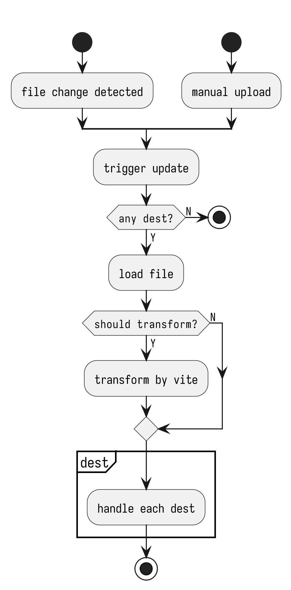

# Transform

| Transform          | Dest                    |
| ------------------ | ----------------------- |
|  |  |

When file changes or manual upload is triggered, vitburner will first get all destination of the each changed file, load the file content, transform it if related `WatchItem.transform` is set, dump if `dumpFiles` is setand finally send it to the server.

## Import path

Say you have the following file structure:

```
src/
  import/
    main.ts
    absolute.ts
    relative.ts
```

`main.ts`

```ts
import { NS } from '@ns';
import { relative } from './relative';
import { absolute } from '@/import/absolute';

export async function main(ns: NS) {
  relative(ns);
  absolute(ns);
}
```

`absolute.ts`

```ts
import { NS } from '@ns';

export function absolute(ns: NS) {
  ns.tprint('Hello, absolute!');
}
```

`relative.ts`

```ts
import { NS } from '@ns';

export function relative(ns: NS) {
  ns.tprint('Hello, relative!');
}
```

This works file for normal vite and ts project. During dev mode, vite will resolve `import` path to the correct file, which is the absolute path to the package root so the vite server can serve it from the file system and transform it.

Transformed `main.ts`

```ts
import { relative } from '/src/import/relative.js';
import { absolute } from '/src/import/absolute.js';
export async function main(ns) {
  relative(ns);
  absolute(ns);
}
```

However, this is not the exact file path we want to upload to the server. We want to upload the file to the server as `/import/relative.js` instead of `/src/import/relative.js`. So the `import` path needs to be transformed in the same way as the file path for each uploaded file.

Also, bitburner only supports abosolute path for import, so you can use vite to transform the relative path to absolute path.

If you are disabling the `transform` option for a file, you need to make sure the import path is correct manually.

```js
import { relative } from '/import/relative.js';
import { absolute } from '/import/absolute.js';
export async function main(ns) {
  relative(ns);
  absolute(ns);
}
```

The absolute import pattern `@/*` can be configured in `vite.config.ts` and `tsconfig.json`. Make sure you are using the same pattern in both files. See [vite docs#resolve-alias](https://vitejs.dev/config/#resolve-alias) and [ts docs#paths](https://www.typescriptlang.org/tsconfig#paths) for more details.
